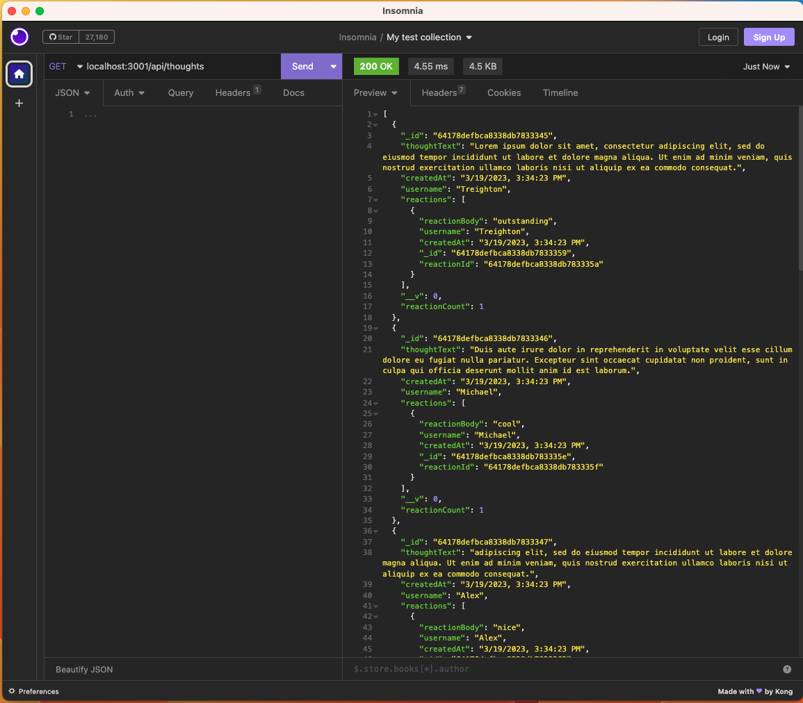

# Scoial Network Api - NoSQL

## Description

This is an API for a social network web application where users can share their thoughts, react to friends’ thoughts, and create a friend list. I have used Express.js for routing, a MongoDB database, and the Mongoose ODM.

## Installation

- Have Nodejs installed (I used v16.18)
- Install npm dependencies
  - use 'npm install' on terminal once navigated to folder
- Have mongoDB installed

## Usage

Install dependencies at the root with `npm i` and then start the server with `node server.js`. Make sure to seed by running `npm run seed` in the terminal. At this point the application is running and you can test the api endpoints with your favorite program.

## Walkthrough Video Link

For testing, please click on the link to watch the video.
[Walkthough Video 🎦](https://drive.google.com/file/d/1TgcLRsDLPdDSnWt8HpsvZtdQfx61pTsd/view)

## Screenshot

## Author

Iqbal Ahmadi
